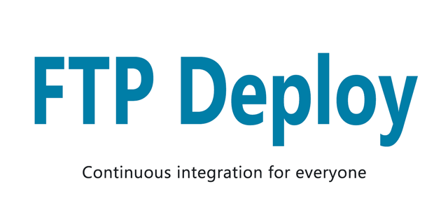

[](https://docs.stepsecurity.io/actions/stepsecurity-maintained-actions)

<p align="center">
  
</p>

Automate deploying websites and more with this GitHub action.

---

### Usage Example
Place the following in `/.github/workflows/main.yml`
```yml
on: push
name: 🚀 Deploy website on push
jobs:
  web-deploy:
    name: 🎉 Deploy
    runs-on: ubuntu-latest
    steps:
    - name: 🚚 Get latest code
      uses: actions/checkout@v6
    
    - name: 📂 Sync files
      uses: step-security/ftp-deploy-action@v4
      with:
        server: ftp.stepsecurity.com
        username: myFtpUserName
        password: ${{ secrets.ftp_password }}
```

---

### Requirements
- You must have ftp access to your server. If your host allows or requires ssh please use this [web-deploy](https://github.com/SamKirkland/web-deploy) action
- Some web hosts change the default port (21), check with your host for your port number

---

### Setup Steps
1. Select the repository you want to add the action to
2. Select the `Actions` tab
3. Select `Blank workflow file` or `Set up a workflow yourself`, if you don't see these options manually create a yaml file `Your_Project/.github/workflows/main.yml`
4. Paste the example above into your yaml file and save
5. Now you need to add a key to the `secrets` section in your project. To add a `secret` go to the `Settings` tab in your project then select `Secrets`. Add a new `Secret` for `password`
6. Update your yaml file settings

---

### Settings
Keys can be added directly to your .yml config file or referenced from your project `Secrets` storage.

To add a `secret` go to the `Settings` tab in your project then select `Secrets`.
I strongly recommend you store your `password` as a secret.

| Key Name                | Required | Example                       | Default Value                 | Description                                                                                                                                                                                                                                                                                                                                                                                                                                                                                                                                                                                                                                          |
|-------------------------|----------|-------------------------------|-------------------------------|------------------------------------------------------------------------------------------------------------------------------------------------------------------------------------------------------------------------------------------------------------------------------------------------------------------------------------------------------------------------------------------------------------------------------------------------------------------------------------------------------------------------------------------------------------------------------------------------------------------------------------------------------|
| `server`                | Yes      | `ftp.stepsecurity.com`         |                               | Deployment destination server                                                                                                                                                                                                                                                                                                                                                                                                                                                                                                                                                                                                                        |
| `username`              | Yes      | `username@stepsecurity.com`    |                               | FTP user name                                                                                                                                                                                                                                                                                                                                                                                                                                                                                                                                                                                                                                        |
| `password`              | Yes      | `CrazyUniquePassword&%123`    |                               | FTP password, be sure to escape quotes and spaces                                                                                                                                                                                                                                                                                                                                                                                                                                                                                                                                                                                                    |
| `port`                  | No       | `990`                         | `21`                          | Server port to connect to (read your web hosts docs)                                                                                                                                                                                                                                                                                                                                                                                                                                                                                                                                                                                                 |
| `protocol`              | No       | `ftps`                        | `ftp`                         | `ftp`: provides no encryption, `ftps`: full encryption newest standard (aka "explicit" ftps), `ftps-legacy`: full encryption legacy standard (aka "implicit" ftps)                                                                                                                                                                                                                                                                                                                                                                                                                                                                                   |
| `local-dir`             | No       | `./myFolderToPublish/`        | `./`                          | Folder to upload from, must end with trailing slash `/`                                                                                                                                                                                                                                                                                                                                                                                                                                                                                                                                                                                              |
| `server-dir`            | No       | `public_html/www/`            | `./`                          | Folder to upload to (on the server), must end with trailing slash `/`                                                                                                                                                                                                                                                                                                                                                                                                                                                                                                                                                                                |
| `state-name`            | No       | `folder/.sync-state.json`     | `.ftp-deploy-sync-state.json` | Path and name of the state file - this file is used to track which files have been deployed                                                                                                                                                                                                                                                                                                                                                                                                                                                                                                                                                          |
| `dry-run`               | No       | `true`                        | `false`                       | Prints which modifications will be made with current config options, but doesn't actually make any changes                                                                                                                                                                                                                                                                                                                                                                                                                                                                                                                                           |
| `dangerous-clean-slate` | No       | `true`                        | `false`                       | Deletes ALL contents of server-dir, even items in excluded with 'exclude' argument                                                                                                                                                                                                                                                                                                                                                                                                                                                                                                                                                                   |
| `exclude`               | No       | [See Example](#exclude-files) | [See Example](#exclude-files) | An array of glob patterns, these files will not be included in the publish/delete process. [List MUST be in this format](#exclude-files). You can use [a glob tester](https://www.digitalocean.com/community/tools/glob?comments=true&glob=%2A%2A%2F.git%2A%2F%2A%2A&matches=false&tests=test%2Fsam&tests=.git%2F%0D&tests=.github%2F%0D&tests=.git%2Ftest%0D&tests=.gitattributes%0D&tests=.gitignore%0D&tests=.git%2Fconfig%0D&tests=.git%2Ftest%2Ftest&tests=.github%2Fworkflows%2Fmain.yml&tests=node_modules%2Ffolder%2F%0D&tests=node_modules%2Fotherfolder%2F%0D&tests=subfolder%2Fnode_modules%2F) to test your pattern(s). |
| `log-level`             | No       | `minimal`                     | `standard`                    | `minimal`: only important info, `standard`: important info and basic file changes, `verbose`: print everything the script is doing                                                                                                                                                                                                                                                                                                                                                                                                                                                                                                                   |
| `security`              | No       | `strict`                      | `loose`                       | `strict`: Reject any connection which is not authorized with the list of supplied CAs. `loose`: Allow connection even when the domain is not certificate                                                                                                                                                                                                                                                                                                                                                                                                                                                                                             |
| `timeout`               | No       | `60000`                       | `30000`                       | Timeout in milliseconds for FTP operations                                                                                                                                                                                                                                                                                                                                                                                                                                                                                                                                                                                                           |


# Common Examples
#### Build and Publish React/Angular/Vue Website
Make sure you have an npm script named 'build'. This config should work for most node built websites.

```yml
on: push
name: 🚀 Deploy website on push
jobs:
  web-deploy:
    name: 🎉 Deploy
    runs-on: ubuntu-latest
    steps:
    - name: 🚚 Get latest code
      uses: actions/checkout@v6

    - name: Use Node.js 24
      uses: actions/setup-node@v6
      with:
        node-version: '16'
      
    - name: 🔨 Build Project
      run: |
        npm install
        npm run build
    
    - name: 📂 Sync files
      uses: step-security/ftp-deploy-action@v4
      with:
        server: ftp.stepsecurity.com
        username: myFtpUserName
        password: ${{ secrets.password }}
```

#### FTPS
```yml
on: push
name: 🚀 Deploy website on push
jobs:
  web-deploy:
    name: 🎉 Deploy
    runs-on: ubuntu-latest
    steps:
    - name: 🚚 Get latest code
      uses: actions/checkout@v6

    - name: 📂 Sync files
      uses: step-security/ftp-deploy-action@v4
      with:
        server: ftp.stepsecurity.com
        username: myFtpUserName
        password: ${{ secrets.password }}
        protocol: ftps
        port: 1234 # todo replace with your web hosts ftps port
```

#### Log only dry run: Use this option for testing
Ouputs a list of files that will be created/modified to sync your source without making any actual changes
```yml
on: push
name: 🚀 Deploy website on push
jobs:
  web-deploy:
    name: 🎉 Deploy
    runs-on: ubuntu-latest
    steps:
    - name: 🚚 Get latest code
      uses: actions/checkout@v6

    - name: 📂 Sync files
      uses: step-security/ftp-deploy-action@v4
      with:
        server: ftp.stepsecurity.com
        username: myFtpUserName
        password: ${{ secrets.password }}
        dry-run: true
```

#### Exclude files
Excludes files
```yml
on: push
name: 🚀 Deploy website on push
jobs:
  web-deploy:
    name: 🎉 Deploy
    runs-on: ubuntu-latest
    steps:
    - name: 🚚 Get latest code
      uses: actions/checkout@v6

    - name: 📂 Sync files
      uses: step-security/ftp-deploy-action@v4
      with:
        server: ftp.stepsecurity.com
        username: myFtpUserName
        password: ${{ secrets.password }}
        exclude: |
          **/.git*
          **/.git*/**
          **/node_modules/**
          fileToExclude.txt
```

`exclude` has the following default value
```yml
exclude: |
  **/.git*
  **/.git*/**
  **/node_modules/**
```
if you overwrite the default value you will probably want to respecify them

---

## FAQ
<details>
  <summary>How to exclude .git files from the publish</summary>

Git files are excluded by default! If you customize the `exclude` option make sure you re-add the default options.
</details>

<details>
  <summary>How to exclude a specific file or folder</summary>

You can use the `exclude` option to ignore specific files/folders from the publish. Keep in mind you will need to re-add the default exclude options if you want to keep them. For example the below option excludes all `.txt` files.

```yml
exclude:
 - *.txt
```

</details>


<details>
  <summary>How do I set a upload timeout?</summary>

github has a built-in `timeout-minutes` option, see customized example below

```yaml
on: push
name: Publish Website
jobs:
  web-deploy:
    name: web-deploy
    runs-on: ubuntu-latest
    timeout-minutes: 15 # time out after 15 minutes (default is 360 minutes)
    steps:
      ....
```
</details>
